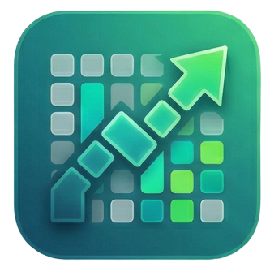

<div align="center">
  
  <h1>Habit Trace</h1>
  <p><b>A beautifully crafted, offline-first habit tracker built with Flutter.</b></p>
  
  [](https://flutter.dev)
  [](https://www.android.com/)
  [](https://www.apple.com/ios/)
</div>

<br>

**Habit Trace** is an intuitive, completely localized habit tracker that helps you stay consistent, hit your goals, and visually measure your progress with dynamic year-long heatmaps. Whether you want to establish a morning routine or start hitting the gym, Habit Trace is the companion you need.

---

## ✨ Features

- 📱 **Native Home Screen Widgets** - Bring your habits straight to your phone's Android launcher with dynamic widgets that update in real-time.
- 🗓️ **Year-Long Heatmaps** - A powerful GitHub-style visual heatmap measuring your daily consistency spanning January through December.
- 🎨 **Deep Customization** - Give each habit its own custom emoji and dedicated accent color for immersive visual organization.
- ⚡ **Offline-First Protocol** - Zero accounts, zero internet lag, and complete privacy. Your data safely persists natively on your device via Riverpod and SharedPreferences.
- 🏆 **Dynamic Streaks & Analytics** - Comprehensive data analysis reporting on your longest streaks and automated achievements.
- 🔔 **Scheduled Local Notifications** - Stay on track with localized reminder notifications directly pushing from your system cache.

## 📸 Screenshots

||||
|:---:|:---:|:---:|
| 
 |
| 
 |

## 🛠️ Architecture and Stack

- **Framework**: [Flutter](https://flutter.dev) & Dart ^3.7.2
- **State Management**: [Riverpod](https://riverpod.dev) — Clean, secure, functional data streams.
- **Persistence**: `shared_preferences` — Fast and reliable local isolated JSON storage.
- **Android Connectivity**: `home_widget` plugin integrated directly via Kotlin app configuration activities (`HabitWidget.kt`).

## 🚀 Getting Started

To run Habit Trace locally, ensure your machine meets the standard Flutter development requirements.

### Installation

1. **Clone the repository:**
```bash
git clone https://github.com/yourusername/habit_trace.git
cd habit_trace
```

2. **Fetch Flutter packages:**
```bash
flutter pub get
```

3. **Install Launcher Icons (If deploying custom design):**
```bash
flutter pub run flutter_launcher_icons
```

4. **Launch the platform:**
```bash
flutter run
```

## 🧩 Adding the Homescreen Widget

Habit Trace contains custom **Kotlin** bridge logic that permits fully interactive widgets directly onto your platform's OS!
- Long press your device's home screen.
- Select **Widgets** and navigate to **Habit Trace**.
- Drag the **Daily Outline** (Large 2x4 layout) or the **Single Habit** (Compact 2x2 layout) right onto your screen.
- The widget will inherently connect to your Flutter logic engine—meaning you can tick off your daily habits without even opening the app!

## 📜 License

This project is licensed under the MIT License - see the [LICENSE](LICENSE) file for details.
